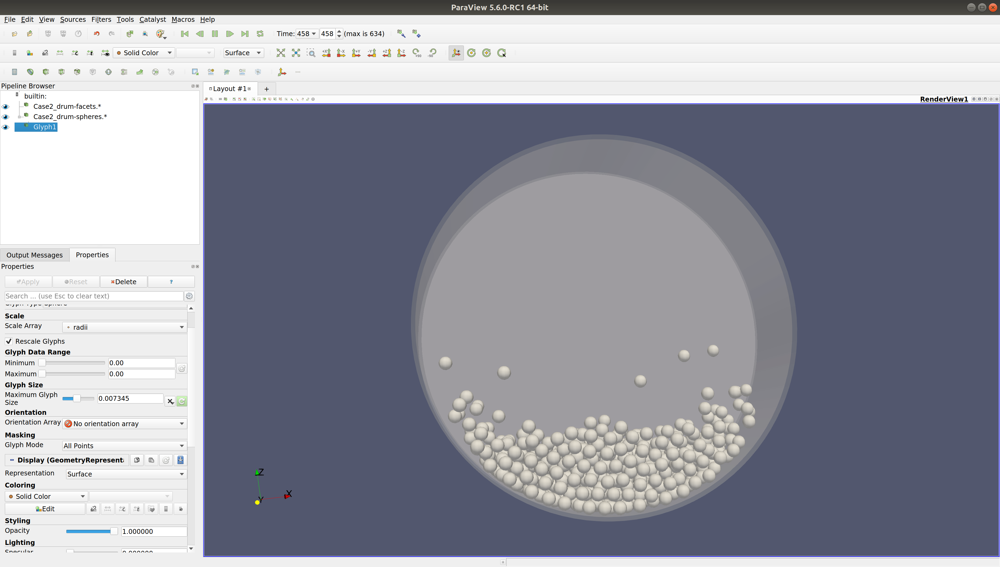

.. _RotatingDrum:

Day 1 - Yade Hands-on part 2
========================

Building a rotating-drum
------------------------

We know where to start:

.. code-block:: python

    angularVelocity = 2 #

    Steel = O.materials.append(FrictMat(young=210e9, poisson=0.2, density=7200, label='Steel'))
    M1 = O.materials.append(FrictMat(young=1.0e9, poisson=0.2, density=2500, label='M1'))

Now download the `drum walls <doc/sphinx/tutorial-short-course-rotating-drum.rst>`_

The next step is to import the sphere and wall text files that we just downloaded:

.. code-block:: python

    from yade import ymport
    facets = ymport.textFacets('Case2_Drum_Walls.txt', color=(0, 1, 0), material=Steel)
    drum_ids = range(len(facets))
    O.bodies.append(facets)
    sp = pack.SpherePack()
    sp.makeCloud(minCorner=(-0.06, -0.02, -0.06), maxCorner=(0.06, 0.02, 0.06), rMean=.004, rRelFuzz=0, num=1000)
    sp.toSimulation()

Where we are using a module called ``ymport``, which has `plenty of additional functionality <https://yade-dem.org/doc/yade.ymport.html>`_,
to import our facets. We are also introducing a very useful function called ``makeCloud`` which allows us to create clouds of particles 
with user defined properties such as the mean radius, ``rMean``. Our `SpherePack()` object has a convenient method for sending the sphere pack
to the simulation with ``toSimulation()``.

We can now define the engine list for our rotating drum:

.. code-block:: python

    O.engines = [
        ForceResetter(),
        InsertionSortCollider([Bo1_Sphere_Aabb(), Bo1_Facet_Aabb()], label="collider"),
        InteractionLoop(
                [Ig2_Sphere_Sphere_ScGeom(), Ig2_Facet_Sphere_ScGeom()],
                [Ip2_FrictMat_FrictMat_MindlinPhys()],
                [Law2_ScGeom_MindlinPhys_Mindlin()],
        ),
        NewtonIntegrator(damping=0, gravity=[0, 0, -9.81], label="newton"),
        RotationEngine(
                rotateAroundZero=True, zeroPoint=(0, 0, 0), rotationAxis=(0, 1, 0), angularVelocity=angularVelocity, ids=drum_ids, label='rotation'
        ),
        VTKRecorder(iterPeriod=1000,fileName='Case2_drum-',recorders=['spheres','facets'], label='vtkrecorder'),
    ]

We see some familiar commands as well as some unfamiliar ones here. ``Bo1_Facet_Aabb()`` and ``Ig2_Facet_Sphere_ScGeom()`` tell Yade that 
our model needs to detect collisions between our spheres and our facets. As for the contact law, this time we will use ``MindlinPhys()``
to determine interparticle stiffnesses for our force calculations. Again we see our familiar ``NewtonIntegrator()`` applying gravity to
our rotating drum. But now, we add a new engine calld ``RotationEngine()`` which allows us to rotate bodies in our scene. We see some
expected arguments to the function such as ``angularVelocity`` and ``zeroPoint``. Finally, we want to visualize the process so 
we are going to add what is referred to as a ``VTKRecorder()``. This will save vtk files to our disk so we can visualize them in 
Paraview later. 

Let's now set our time-step:

.. code-block:: python

    O.dt=0.8*PWaveTimeStep()

Here we used our familiar ``PWaveTimeStep()`` to estimate the critical step.
We now need to tell the scene that we are ready to start:

.. code-block:: python

    O.run()

Finally, we run it with our familiar command in the terminal (using the `-j` flag to indicate the number of cores we want to run the simulation on):

.. code-block:: bash
    
    yade -j4 rotating_drum.py

Note: Yade will run indefinitely since we didnt provide ``O.run()`` with a number of iterations. The user needs to manually stop/pause when they are finished
watching the simulation.

Visualizing the output files
----------------------------

Now that we have run our simulation and collected our vtk files using ``VTKRecorder()``, we can now view those files in Paraview. Start by 
opening Paraview (via the GUI or via command line):

.. code-block:: bash
    paraview

Now we can click on `file -> open` and navigate to the folder where you saved the vtk files from the rotating drum. Click on the spheres and facet files 
(hold ctrl to select multiple) and select `ok` from the file dialog. 

Next, we will click on the green "Apply" button on the left of the window. Now we see the drum, but it is opaque, so we cant seee any particles on the inside.
Paraview gives full control over the visualization of the objects. For example, we change the opacity of the drum by clicking on the `drum-facets` in the ``Pipeline Browser``
on the left, and then scrolling down to change the `Opacity`. Click on the green `Play` button at the top of the window to iterate thru the steps. 

We see that the particles are not the proper size, so we can fix that by clicking on the `Glyph` icon right above the `Pipeline Browser` on the left. We can select the
`Glyph Type`, to be `sphere` and the `Scale Array` to be `radii`. It should look something like the following image:

.. _fig-paraview2:

	Example of a paraview pipeline.

Example script
---------------

Please find a full script located in the `examples folder <https://gitlab.com/yade-dev/trunk/-/blob/master/examples/DEM2020Benchmark/Case2_rotating_drum_openmp.py>`_
