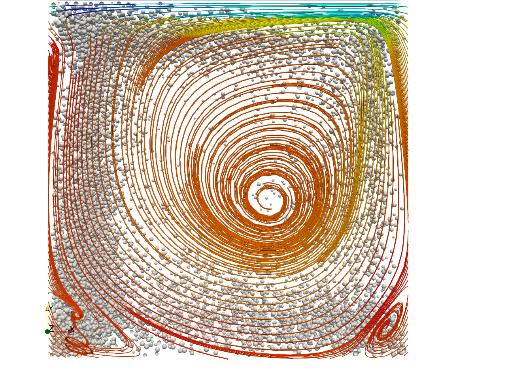

# Yade-OpenFOAM-coupling
An OpenFOAM solver for realizing CFD-DEM simulations with the Open Source Discrete Element Solver Yade-DEM. 
 * Fast mesh search (including range based search) based on k-d Tree algorithm, faster than the original Octree search offered by OpenFOAM (mesh.findCell,  mesh.findNearest).
 * Gaussian interpolation of field variables. 
 * Simple point-force coupling (icoFoamYade) solver
 * Full 4-way coupling (pimpleFoamYade) solver (under validation).
 * Documentation : https://yade-dev.gitlab.io/trunk/FoamCoupling.html
 * Examples : https://gitlab.com/yade-dev/trunk/tree/master/examples/openfoam

## UPDATE (Feb 2025)

After Feb 2025 the git repository of the coupling solver is merged into Yade's repository on gitlab and most information should be searched in Yade's documentation (this README may not be freuently updated).
Nevertheless the coupled solver is DEM-agnostic, it is compiled independently and it could be used as an interface to other DEM codes.

An older version of the coupling, which was using OpenFoam6, is archived in branch FOAM6couplingArchive (https://gitlab.com/yade-dev/trunk/-/tree/FOAM6couplingArchive).

## UPDATE (27 Nov 2019) 
* Full parallel coupling between Yade and OpenFOAM (as Yade is now fully parallel based on MPI) 

Prerequisites : A Yade version with the FoamCoupling engine (https://gitlab.com/yade-dev/trunk). A supported version of OpenFOAM (see https://yade-dev.gitlab.io/trunk/FoamCoupling.html).

